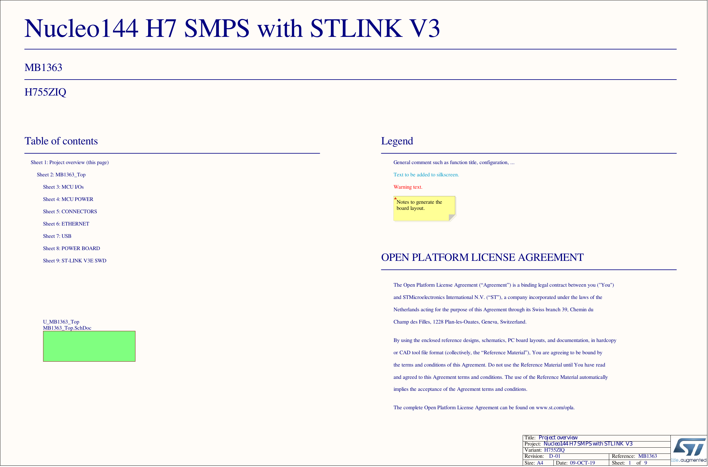

# ECG Arrhythmia Classifier — STM32H755ZI-Q Edge AI

Deploying a tiny 1D-CNN ECG arrhythmia classifier on the **NUCLEO-H755ZI-Q** (dual-core STM32H755ZI, Cortex-M7 + M4) using **ST X-CUBE-AI**. The model classifies 180-sample ECG windows into 5 AAMI heartbeat categories in real time, running entirely on-chip with no cloud dependency.

---

## Hardware

| Item | Detail |
|------|--------|
| Board | NUCLEO-H755ZI-Q |
| MCU | STM32H755ZIT6 (Cortex-M7 @ 480 MHz + Cortex-M4 @ 240 MHz) |
| RAM | 1 MB (DTCM + AXI SRAM) |
| Flash | 2 MB (dual bank) |
| Output | UART3 → USB virtual COM port (ST-Link) |

The classifier runs on the **CM7 core**. CM4 is held in stop mode during normal operation (dual-core sync via hardware semaphore `HSEM_ID_0`).

### Board Schematic



> Full schematic (all 11 pages): [`../Other_files/NUCLEO-H755ZI-Q_schematic.pdf`](../Other_files/NUCLEO-H755ZI-Q_schematic.pdf)

---

## Model Architecture

Trained in Keras and converted to C with **ST EdgeAI Core 2.2.0**. Source dataset: [MIT-BIH Arrhythmia Database](https://physionet.org/content/mitdb/1.0.0/).

```
Input: (180, 1) float32  ← 180-sample ECG window

Conv1D(filters=8,  kernel=5, activation=relu) + MaxPool(2)  →  (88, 8)
Conv1D(filters=16, kernel=3, activation=relu) + MaxPool(2)  →  (43, 16)
GlobalAveragePooling1D                                       →  (16,)
Dense(16, relu)                                              →  (16,)
Dense(5,  softmax)                                           →  (5,)

Output: 5-class softmax probability vector
```

### Output Classes (AAMI standard)

| Index | Symbol | Class |
|-------|--------|-------|
| 0 | N | Normal Beat |
| 1 | S | Supraventricular Ectopic Beat |
| 2 | V | Ventricular Ectopic Beat |
| 3 | F | Fusion Beat |
| 4 | Q | Unknown / Other |

### Model Footprint

| Metric | Value |
|--------|-------|
| Parameters | 822 |
| Weights (flash) | 3,288 bytes (~3.2 KB) |
| Activations (RAM) | 3,136 bytes (~3.1 KB) |
| Total RAM | ~6.3 KB |
| MACs | ~46,800 |

---

## Prerequisites

### Software
- [STM32CubeIDE](https://www.st.com/en/development-tools/stm32cubeide.html) (≥ 1.15)
- [ST EdgeAI / X-CUBE-AI](https://www.st.com/en/embedded-software/x-cube-ai.html) ≥ 2.2.0 (for regenerating the model files if needed)
- STM32CubeMX (bundled with CubeIDE)

### Hardware
- NUCLEO-H755ZI-Q board
- USB cable (ST-Link / virtual COM)
- Serial terminal (e.g., PuTTY, minicom, Arduino Serial Monitor) at **115200 8N1**

---

## Build & Flash

### Using STM32CubeIDE

1. Clone or download this repository
2. Open STM32CubeIDE → **File → Open Projects from File System**
3. Select the `ECG_Classifier/` folder
4. Build: **Project → Build All** (or Ctrl+B)
5. Flash: **Run → Debug** (or the Run button with the ST-Link connected)

### Project Structure

```
ECG_Classifier/
├── main.c                   ← Application entry point, normalize + classify loop
├── main.h                   ← MCU peripheral handles & pin defines
├── stm32h7xx_it.c/h         ← Interrupt handlers
├── NUCLEO-H755ZI-Q.ioc      ← CubeMX configuration (clock, peripherals, AI)
├── images/
│   └── NUCLEO-H755ZI-Q_schematic.png
└── model/
    ├── app_x-cube-ai.c/h    ← X-CUBE-AI inference pipeline (acquire → run → output)
    ├── network.c/h          ← Generated C network forward pass
    ├── network_data.c/h     ← Generated weight arrays
    ├── network_data_params.c/h
    ├── network_config.h     ← Layer/buffer size macros
    ├── bsp_ai.h             ← BSP AI abstraction
    ├── aiSystemPerformance.c/h
    ├── lc_print.c/h
    └── network_generate_report.txt  ← Model summary from ST EdgeAI
```

---

## Serial Output

Connect to UART3 (appears as a COM port via ST-Link USB) at **115200 baud**:

```
STM32H755ZI-Q ECG Classifier Initialized
----------------------------------------

--- Classifying Sample ECG Beat ---
Input window: 180 samples, normalized
Prediction: V - Ventricular Ectopic Beat
Confidence: 94.3%

--- Classifying Sample ECG Beat ---
...
```

The firmware loops every 5 seconds, running inference on the hardcoded test sample (a Ventricular Ectopic Beat from MIT-BIH record 231, sample #527). To classify your own ECG data, replace the `sample_ecg_input[]` array in `main.c` with your own 180-sample window.

---

## Regenerating the Model (Optional)

If you retrain the Keras model and need to update the C files in `model/`:

1. Open **STM32CubeIDE → CubeMX** (double-click `.ioc`)
2. Go to **Software Packs → X-CUBE-AI → Analyze**
3. Load your updated `.keras` or `.tflite` model
4. Click **Generate Code** — the `model/network*.c/h` files will be regenerated automatically

---

## Preprocessing Details

Before inference, each 180-sample window is normalized:

```c
mean   = sum(window) / 180
std    = sqrt(sum((x - mean)^2) / 180) + 1e-6
output = (window - mean) / std
```

This matches the z-score normalization applied during training.

---

## Data Source

Model trained on the [MIT-BIH Arrhythmia Database](https://physionet.org/content/mitdb/1.0.0/):

> Moody GB, Mark RG. The impact of the MIT-BIH Arrhythmia Database. IEEE Eng in Med and Biol 20(3):45-50 (May-June 2001).

---

## License

MIT
